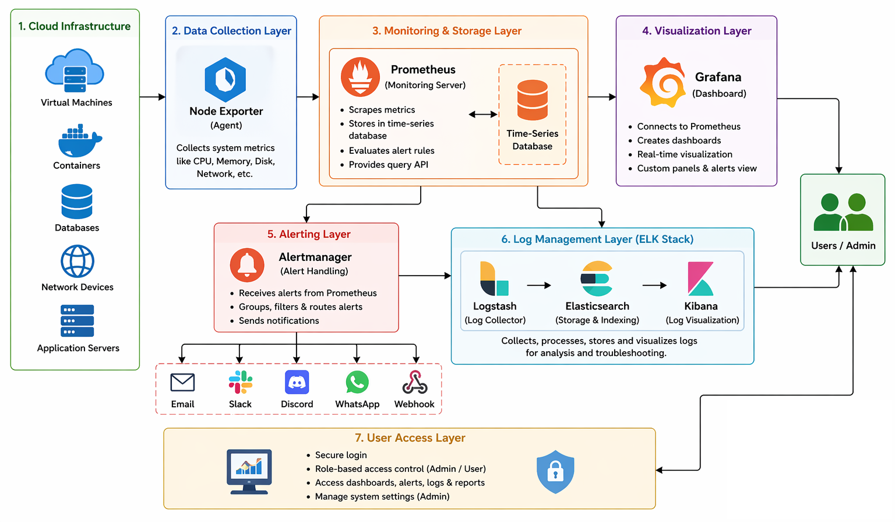
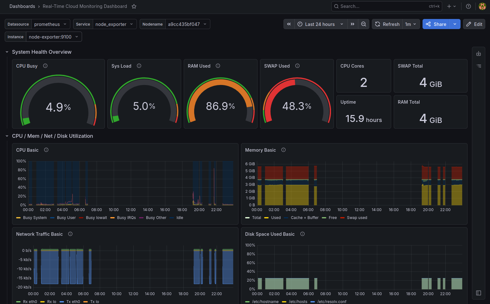
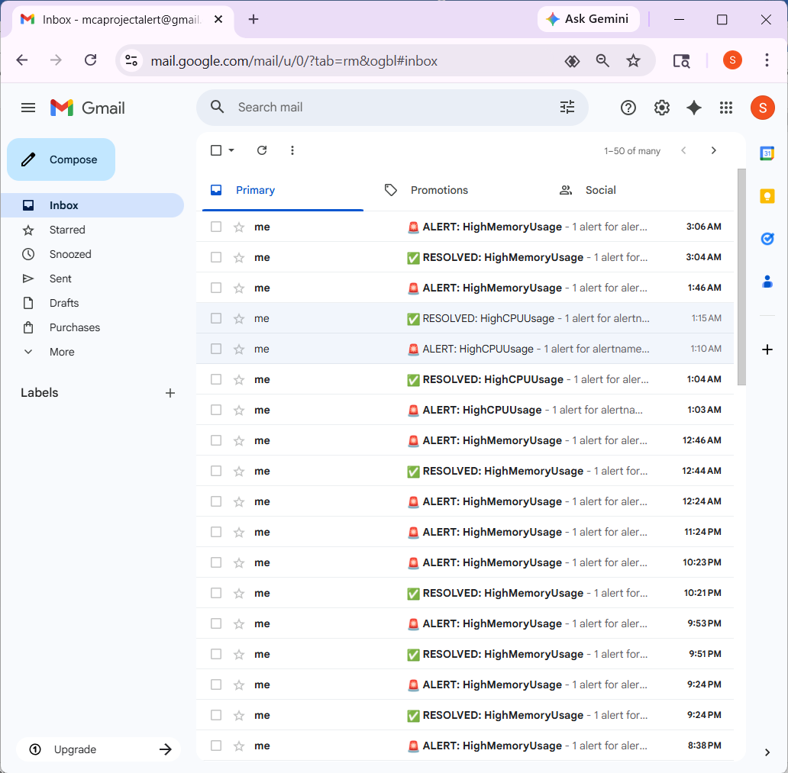
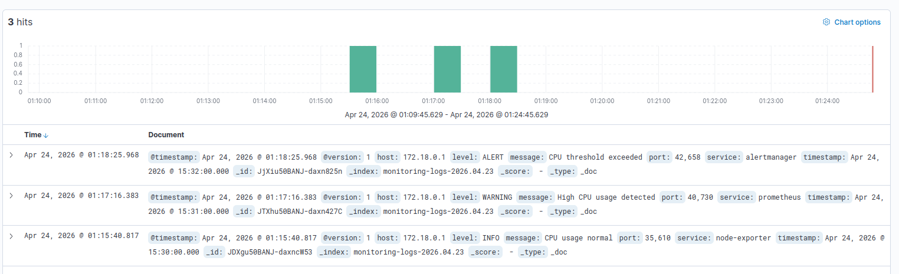
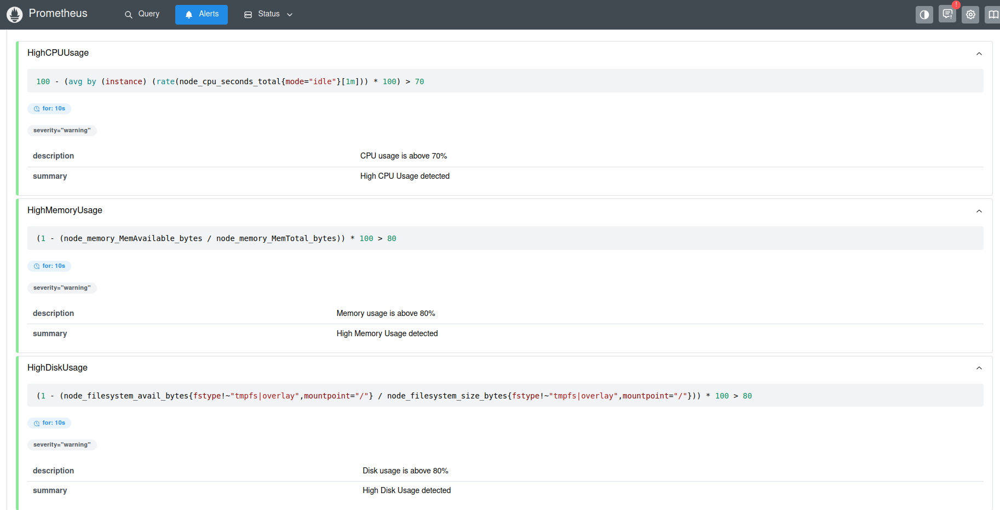

# 🚀 Real-Time Cloud Infrastructure Monitoring System

## 📌 Overview
This project is a **real-time cloud monitoring and alerting system** designed to continuously track system performance and health.

It collects system metrics, visualizes them through dashboards, generates alerts when thresholds are exceeded, and centralizes logs for easy troubleshooting.

The system is built using modern DevOps tools like **Prometheus, Grafana, Alertmanager, and ELK Stack**, making it scalable and practical for real-world environments.

---

## 🎯 Features

- 📊 Real-time monitoring of CPU, Memory, Disk & Network  
- 🚨 Automatic alert generation based on thresholds  
- 📧 Email notifications for **FIRING & RESOLVED** alerts  
- 📈 Interactive Grafana dashboards  
- 📂 Centralized log monitoring using ELK Stack  
- 🐳 Easy deployment using Docker  

---

## 🛠️ Technologies Used

- Prometheus  
- Grafana  
- Alertmanager  
- Elasticsearch  
- Logstash  
- Kibana  
- Docker & Docker Compose  
- Ubuntu (VMware)  

---

## 🏗️ System Architecture



---

## ⚙️ Project Structure

```text
cloud-monitoring/
├── docker-compose.yml
├── prometheus/
│   ├── prometheus.yml
│   └── alert.rules.yml
├── alertmanager/
│   └── alertmanager.yml
├── logstash/
│   └── pipeline/
│       └── logstash.conf
```

---

## 🚀 Setup Instructions

### 1️⃣ Install Docker
```bash
sudo apt update
sudo apt install docker.io -y
```

### 2️⃣ Install Docker Compose
```bash
sudo apt install docker-compose -y
```

### 3️⃣ Run the Project
```bash
docker-compose up -d
```

---

## 🌐 Access Services

| Service | URL |
|--------|-----|
| Grafana | http://localhost:3000 |
| Prometheus | http://localhost:9090 |
| Alertmanager | http://localhost:9093 |
| Kibana | http://localhost:5601 |

---

## 📸 Screenshots

### 📊 Grafana Dashboard


### 🚨 Alert Email


### 📂 Kibana Logs


### 📈 Prometheus Targets


---

## 🧪 Testing

- Unit Testing ✔  
- Integration Testing ✔  
- Stress Testing ✔  
- ELK Stack Testing ✔  

---

## 📈 Results

- Real-time monitoring achieved  
- Alerts triggered within seconds  
- Logs processed efficiently  
- System remained stable under load  

---

## 🔮 Future Scope

- Deployment on cloud platforms (AWS/Azure)  
- Kubernetes-based monitoring  
- AI-based anomaly detection  
- Mobile dashboard  

---

## 👨‍💻 Author

**Shubham Raj**  
MCA Final Year Student  

---


This project demonstrates how multiple open-source tools can be integrated to build a **complete and scalable monitoring solution**.  
It improves system visibility, enables faster issue detection, and supports proactive system management.
